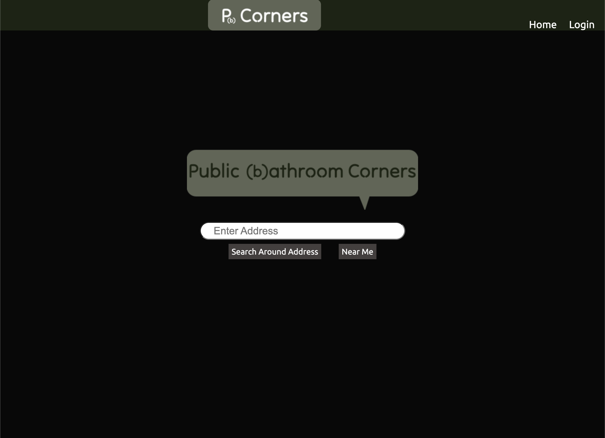

# public-bathroom-corners

## Link

https://pb-corners.herokuapp.com/

## Routing Table
|       **URL**   | **REST Route** | **HTTP Verb** | **CRUD Action** |   **EJS View(s)**        |
| --------------- | -------------- | ------------- | --------------- | ------------------------ |
| /               | N/A            | GET           | read            | index.ejs                | 
| /reviews/index/:id | index       | GET           | read            | reviews.ejs, 404.ejs     |
| /reviews/full/:bathId/:reviewId| show | GET        | read          |   full-review.ejs        | 
| /reviews/new/:id   | new            | GET           | read            | new-post.ejs          | 
| /reviews/post/:id  | create         | POST          | create          |                          |
| /reviews/edit-post/:bathId/:reviewId| edit | GET    | read            | edit-post.ejs        |
| /reviews/edit/:bathId/:reviewId | update | PATCH/PUT| update          |                          |
| /reviews/delete/:bathId/:reviewId | destroy | DELETE | delete          |                          |
| /bathroom/:id    | show           | GET           | read            | bathroom.ejs                |
| /bathroom/create/:id   | create         | POST           | create             |                |
| /bathroom/update/:id   | show           | PATCH/PUT           | update             |                |
| /*              | N/A            | GET           | N/A             | 404.ejs                  |

## Technologies Used

- Node.js 
- Axios 
- dotenv 
- ejs 
- express 
- express-session
- method-override
- mongoose
- passport
- passport-google-oauth
- livereload
- connect-livereload

## Installation

none through heroku  
all packages installed if using through vscode

## User Stories

As a user, I want to be able to find public bathroom within a specified area and leave reviews of the specified spot, so I can find a public bathroom around me and help others find a good bathroom to use

## Wireframes

https://www.figma.com/proto/suEylFeC0gfdXud8HuFuCq/Project-1?node-id=32%3A3&scaling=scale-down&page-id=32%3A2

## Issues

- only able to sign in but haven't constructed a "Your Profile" page yet

<a href="https://www.flaticon.com/free-icons/poop" title="poop icons">Poop icons created by Freepik - Flaticon</a>
